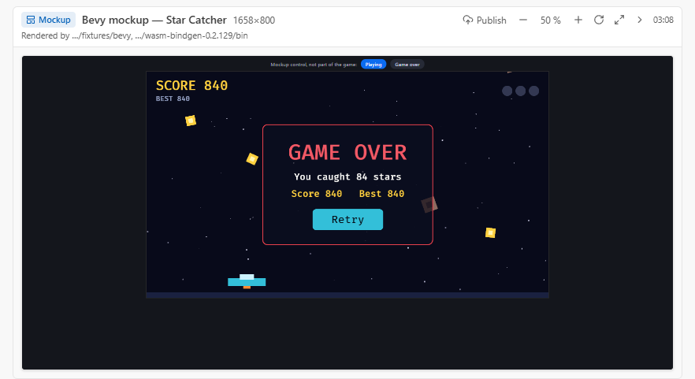
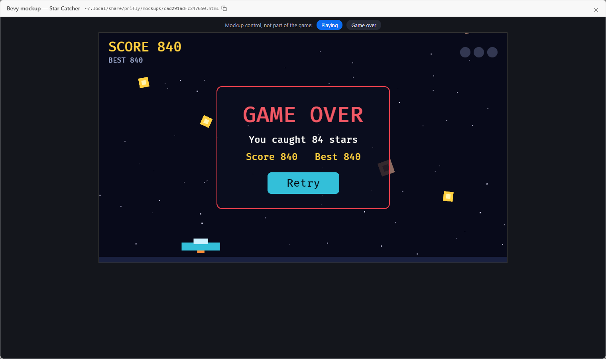

# prifly-mockup-bevy

A prifly mockup recipe for **Bevy**, the Rust game engine, built to wasm. prifly
does not cover Bevy itself; this pack adds it. A mockup of a Bevy scene is rendered by real Bevy (compiled to
`wasm32-unknown-unknown`, drawn through WebGL2) and packaged as one self-contained HTML file.

## Use it in prifly

Add the pack to `packs.json` in prifly's mockup-stacks folder (`~/.local/share/prifly/mockup-stacks/packs.json`):

```json
{ "packs": [{ "name": "bevy", "url": "https://github.com/jimmy927/prifly-mockup-bevy.git" }] }
```

or set `PRIFLY_MOCKUP_STACK_PACKS=bevy=https://github.com/jimmy927/prifly-mockup-bevy.git` for the host. prifly clones
it in the background and pulls at most once a day; the recipe then shows up in `mockup_recipe` for any project that has
`bevy` in its `Cargo.toml` (or a `Trunk.toml`). A project can also copy `mockup-stacks/bevy.md` into its own
`.prifly/mockup-stacks/`.

## The recipe in one paragraph

Build the project with `cargo build --release --target wasm32-unknown-unknown` (features `2d` + `ui`, size-optimised
release profile), run `wasm-bindgen --target no-modules --remove-name-section`, shrink with binaryen's `wasm-opt -Oz`,
and pack the wasm and the glue with prifly's `mockup-kit pack-wasm generic` plus a small `boot.js` that creates the
canvas, starts the module from the embedded bytes and sets `window.__mockupReady` after the game reports its first
frames. The proof project (a 2D arcade scene: sprites, a `bevy_ui` HUD, two `States`) builds to a 7.3 MB page; a cold
build takes about 8 minutes of cargo, a repack 25 seconds. States are chosen by `location.hash`. Details, timings and
gotchas are in [`mockup-stacks/bevy.md`](mockup-stacks/bevy.md).

## Layout

- `mockup-stacks/bevy.md`: the recipe (frontmatter validated by `scripts/check.ts`).
- `mockup-stacks/fixtures/bevy/`: the proof project (`build.sh` checks the manifest; `FULL=1 ./build.sh` builds the page).
- `scripts/check.ts`: bun-only validation of every recipe, used by CI.

## Check

```
bun scripts/check.ts
```

From a prifly checkout the full checker also works on this folder:
`bun run mockup-stacks:check --layer project --project <path to this repo>` after copying `mockup-stacks/` to
`<path>/.prifly/mockup-stacks/`, or by cloning the repo into the packs folder.

## Screenshots





## License

MIT, see [LICENSE](LICENSE). Bevy is MIT or Apache-2.0.
